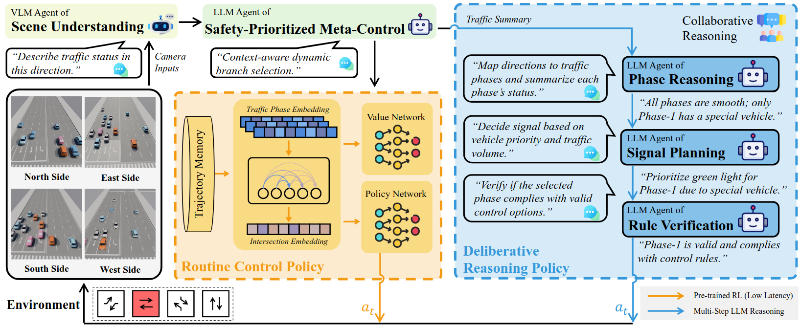
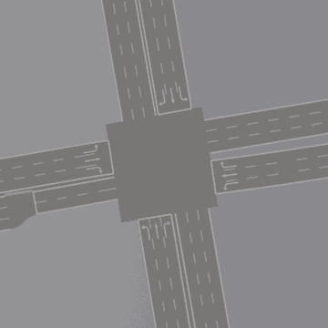
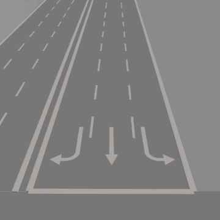
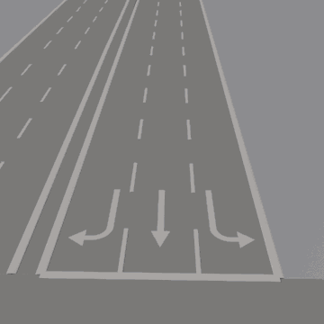
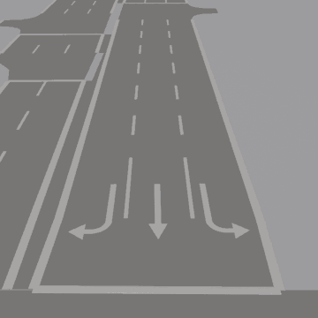
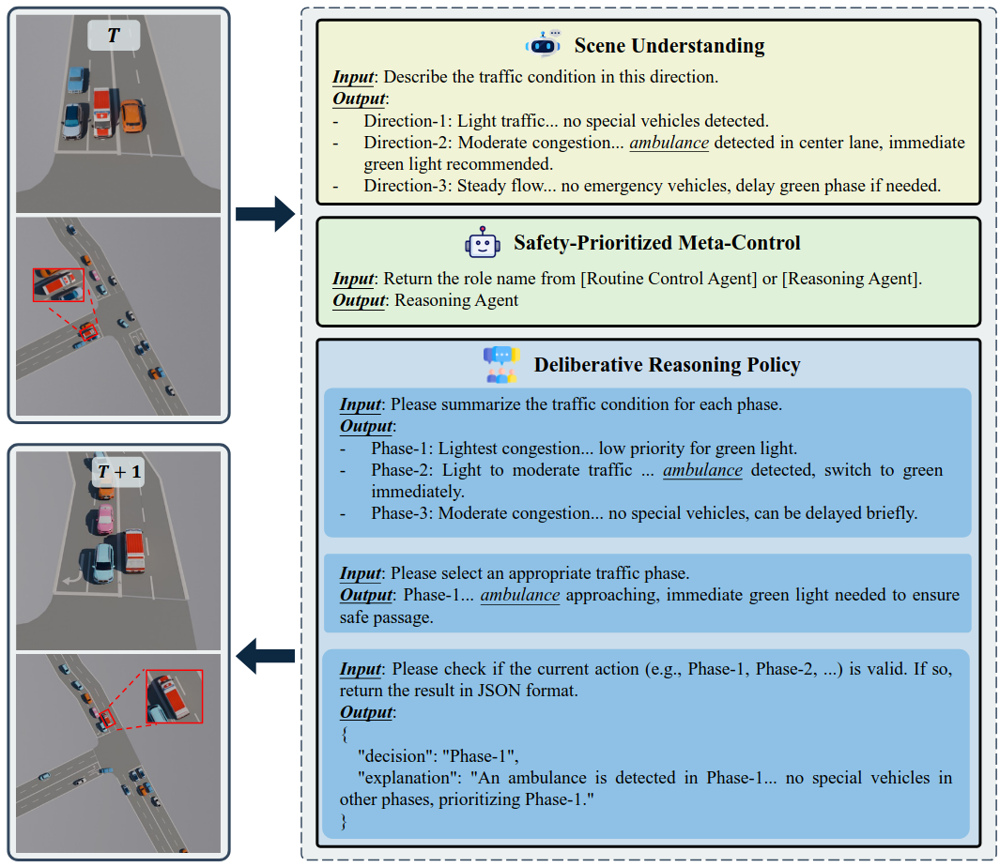
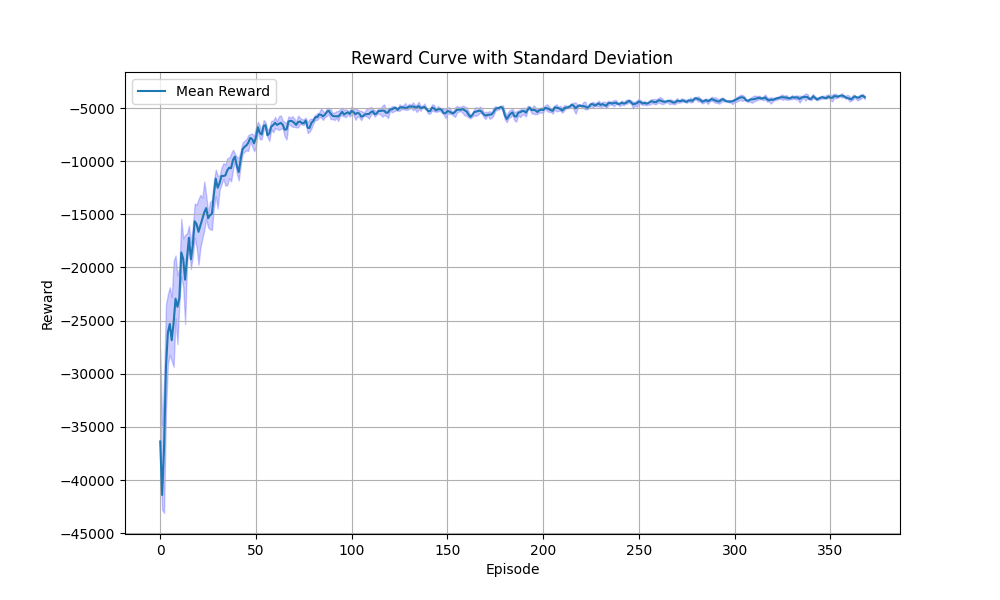
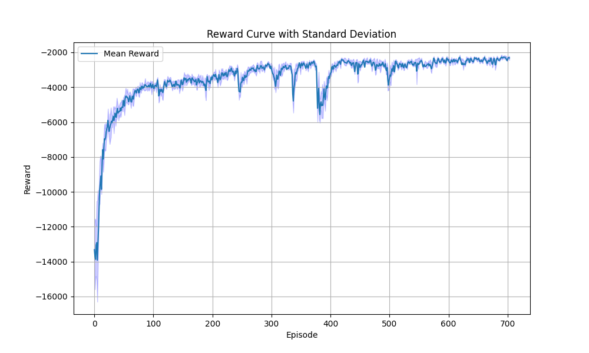
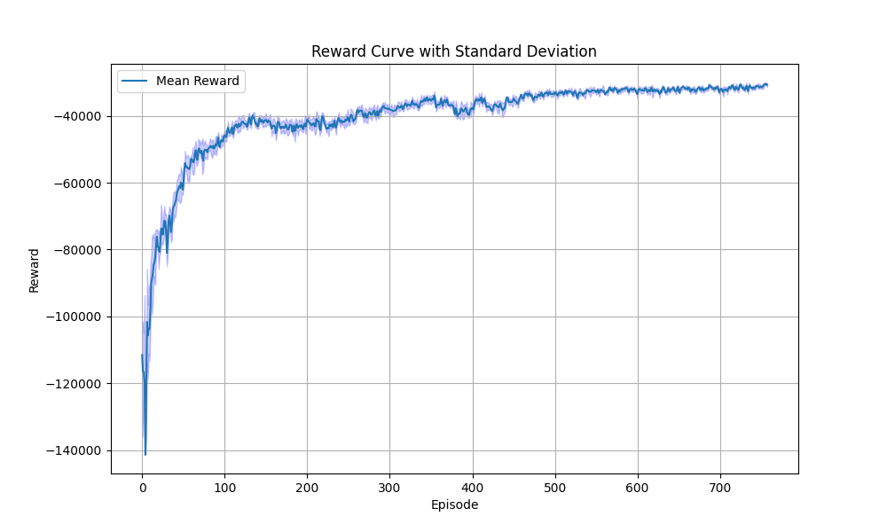

<!--
 * @Author: Maonan Wang
 * @Date: 2025-04-18 18:22:47
 * @Description: VLMLight
 * @LastEditors: WANG Maonan
 * @LastEditTime: 2025-07-10 21:53:05
-->
# VLMLight: Traffic Signal Control via Vision-Language Meta-Control and Dual-Branch Reasoning

[](https://www.arxiv.org/abs/2505.19486)
[](https://opensource.org/licenses/Apache-2.0)
[](https://www.python.org/downloads/)




Official implementation of [VLMLight: Traffic Signal Control via Vision-Language Meta-Control and Dual-Branch Reasoning](https://www.arxiv.org/abs/2505.19486).

## 📌 News
- **[June 2025]** Codebase open-sourced.
- **[May 2025]** Initial preprint released on arXiv, [VLMLight](https://www.arxiv.org/abs/2505.19486).

## 🚀 Overview

VLMLight presents a novel vision-language multimodal framework for adaptive traffic signal control, featuring:

1. The first vision-based traffic control system utilizing visual foundation models for scene understanding;
2. A dual-branch architecture combining fast RL policies with deliberative LLM reasoning
3. Enhanced handling of safety-critical scenarios through multi-agent collaboration

## ✨ Key Features

### Image-Based Traffic Simulation
First multi-view visual traffic simulator enabling context-aware decision making:

| BEV       | North     | East      | South     | West      |
|-----------|-----------|-----------|-----------|-----------|
|  |  |  |  |  |

### Dual-Branch Architecture
- **Fast RL Policy**: Efficient handling of routine traffic
- **Deliberative Reasoning**: Structured analysis for complex scenarios
- **Meta-Controller**: Dynamic branch selection based on real-time context

### Safety-Critical Event Handling
Specialized pipeline for emergency vehicle prioritization:

<div align=center>
   
</div>
<p align="center">Deliberative Reasoning policy for complex traffic in Massy.</p>

## 🛠️ Installation

1. Install [TransSimHub](https://github.com/Traffic-Alpha/TransSimHub):
```bash
git clone https://github.com/Traffic-Alpha/TransSimHub.git
cd TransSimHub
pip install -e ".[all]"
```

2. Install [Qwen-Agent](https://github.com/QwenLM/Qwen-Agent):
```bash
pip install -U "qwen-agent[gui,rag,code_interpreter,mcp]"
# Or use `pip install -U qwen-agent` for the minimal requirements.
# The optional requirements, specified in double brackets, are:
#   [gui] for Gradio-based GUI support;
#   [rag] for RAG support;
#   [code_interpreter] for Code Interpreter support;
#   [mcp] for MCP support.
```

## 🏃 Getting Started

VLMLight provides both [English](./vlm_tsc_en/) and [Chinese](./vlm_tsc_zh/) implementations. The following examples demonstrate the English version usage. For Chinese version, simply replace `vlm_tsc_en` with `vlm_tsc_zh` in all paths and commands.

### 1. Model Configuration
Configure your LLM/VLM endpoints in `vlm_tsc_en/vlmlight_decision.py`:

```python
llm_cfg = {
    'model': 'Qwen/Qwen2.5-72B-Instruct-AWQ',
    'model_type': 'oai',
    'model_server': 'http://localhost:5070/v1',
    'api_key': 'token-abc123',

    'generate_cfg': {
        'top_p': 0.8,
    }
} # Language Model

llm_cfg_json = {
    'model': 'Qwen/Qwen2.5-72B-Instruct-AWQ',
    'model_type': 'oai',
    'model_server': 'http://localhost:5070/v1',
    'api_key': 'token-abc123',

    'generate_cfg': {
        'top_p': 0.8,
        'response_format': {"type": "json_object"},
    }
} # Language Model

vlm_cfg = {
    'model': 'Qwen/Qwen2.5-VL-32B-Instruct-AWQ',
    'model_type': 'qwenvl_oai',
    'model_server': 'http://localhost:5030/v1',
    'api_key': 'token-abc123',

    'generate_cfg': {
        'top_p': 0.8,
    }
} # Vision Language Model
```

### 2. RL Policy Training
Train RL policies for baseline control:
```bash
cd rl_tsc
python train_rl_tsc.py
```

Pretrained models available in [rl_tsc/results](./rl_tsc/results/):

| Hongkong YMT | France Massy | SouthKorea Songdo |
|--------------|--------------|-------------------|
|  |  |  |

### 3. Run VLMLight
Execute the decision pipeline:
```bash
cd vlm_tsc_en
python vlmlight_decision.py
```

## 📂 Repository Structure

```
.
├── assets/                   # Visual assets for documentation
├── result_analysis/          # Trip information analysis tools
│   └── analysis_tripinfo.py  # Performance metric calculation
├── rl_tsc/                   # Reinforcement learning components
│   ├── _config.py           # RL training configuration
│   ├── eval_rl_tsc.py       # RL policy evaluation
│   ├── train_rl_tsc.py      # RL policy training
│   └── utils/               # RL helper functions
├── sim_envs/                 # Traffic simulation scenarios
│   ├── France_Massy/        # Massy, France intersection
│   ├── Hongkong_YMT/        # YMT, Hong Kong intersection
│   └── SouthKorea_Songdo/   # Songdo, South Korea intersection
├── vlm_tsc_en/               # English version implementation
│   ├── _config.py           # English agent configuration
│   ├── utils/               # English processing utilities
│   └── vlmlight_decision.py # English decision pipeline
└── vlm_tsc_zh/               # Chinese version implementation
    ├── _config.py           # Chinese agent configuration
    ├── utils/               # Chinese processing utilities
    └── vlmlight_decision.py # Chinese decision pipeline
```

## 📚 Citation
If you find this work useful, please cite our papers:

```
@article{wang2025vlmlight,
  title={VLMLight: Traffic Signal Control via Vision-Language Meta-Control and Dual-Branch Reasoning},
  author={Wang, Maonan and Chen, Yirong and Pang, Aoyu and Cai, Yuxin and Chen, Chung Shue and Kan, Yuheng and Pun, Man-On},
  journal={arXiv preprint arXiv:2505.19486},
  year={2025}
}
```

## 🙏 Acknowledgements

We thank our collaborators from SenseTime and Shanghai AI Lab (in alphabetical order):
- Yuheng Kan (阚宇衡)
- Zian Ma (马子安) 
- Chengcheng Xu (徐承成) 

for their contributions to the [TransSimHub](https://github.com/Traffic-Alpha/TransSimHub) simulator development.

## 📫 Contact

If you have any questions, please open an issue in this repository. We will respond as soon as possible.